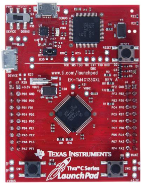

# TM4C123-Minimal-RTOS
 
This project intends to expose the underlying aspects of a Real-Time Operating System (RTOS) kernel. There are several implementations of RTOS in the market, including a kernel, and various resources to handle networks, file systems, USB interfaces, among other features effectively. The approach taken in this project was minimal, and only the essential aspects of the kernel were included, such as scheduling, management of critical sections, and a mechanism (semaphores) for synchronization and data sharing between tasks.

Regarding the scheduling algorithm, the scheduler implements a Fixed Priority algorithm to decide which task runs next. For multiple tasking, the OS carries out context switching through the System Tick Timer (SysTick) interrupt generated on every millisecond (time slice).

I would like to recommned Jonathan Valvano ARM Cortex-M Microcontrollers book series, since they provided the basis of this project.

  

## Software

* Keil MDK-ARM Version 5.

## Hardware

* TM4C123GH6PM - Texas Instruments Launchpad.

## License

This project is licensed under the MIT License - see the [LICENSE.md](LICENSE.md) file for details.